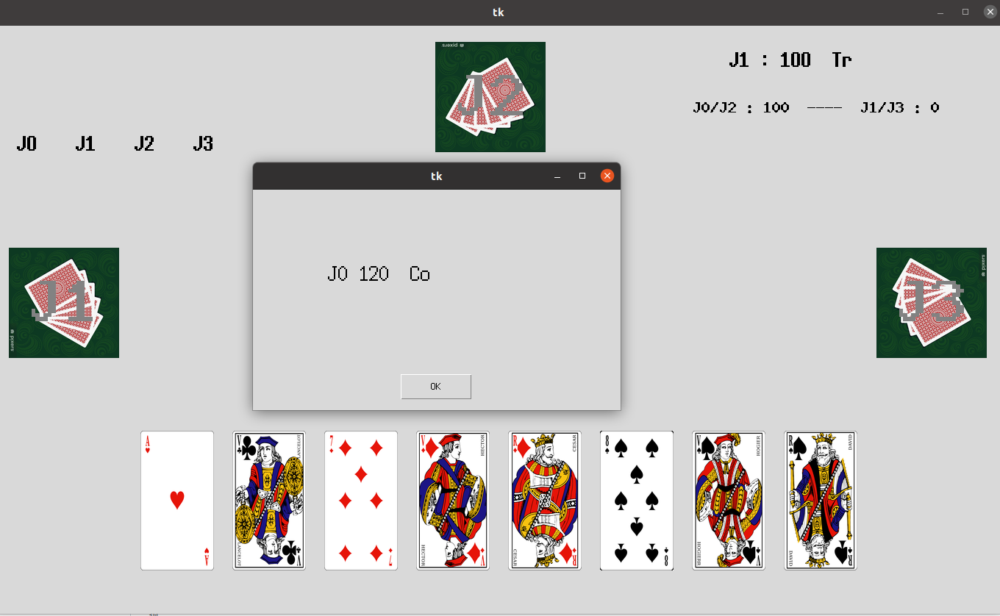
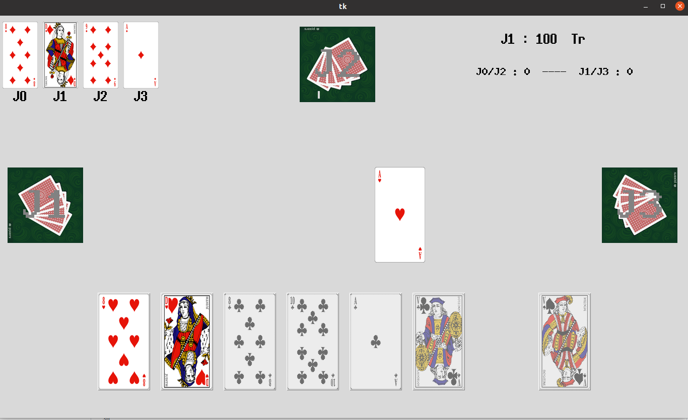
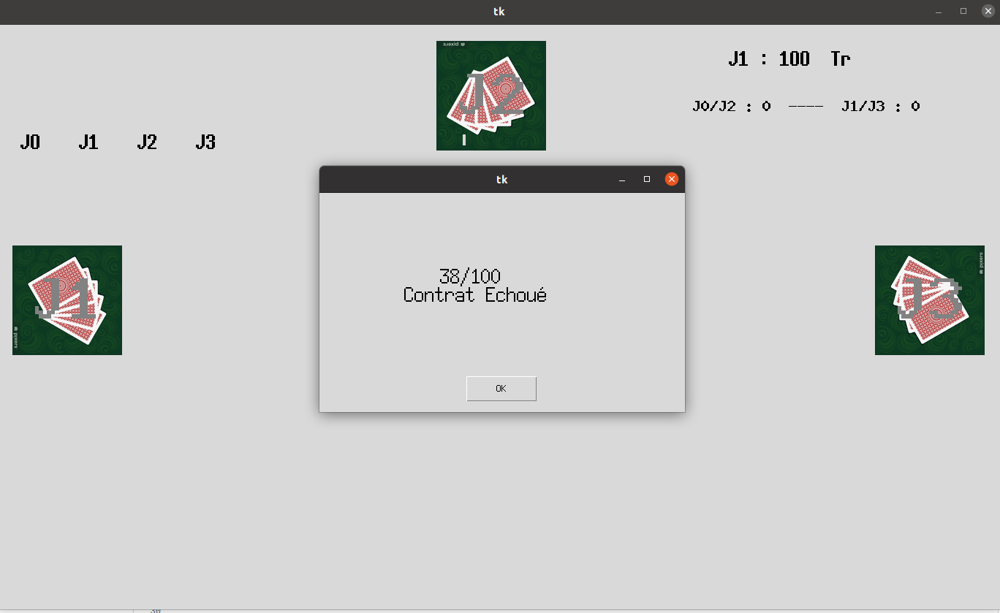

# Belote-contree-game
Game with interface to play belote - developed in python

    

## :ledger: Index

- [Project goal](#beginner-project-goal)
- [Future developments](#wrench-future-developments)
- [Gallery](#camera-gallery)
- [License](#lock-license)

## :beginner: Project goal
The goal of this personal project is to familiarize myself with object-oriented programming, machine learning and the implementation of graphical interface with Python

Consequently, I decided to develop a game of "belote contrée" with interface. Then, I wanted to integrate an AI based on reinforcement.

For the moment the project is still under development and the AI is not yet integrated. This should happen by early next year.

# :wrench: Future developments
  - Clean up the code and comment it
  - Add docstring
  - Add documentation
  - Implementation of a multiplayer mode
  - Implementation of AI based on reinforcement

##  :camera: Gallery
### 1. Bidding

### 2. Game

### 3. Result

##  :lock: License
Add a license here, or a link to it.
